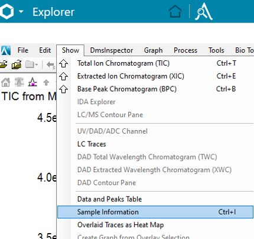
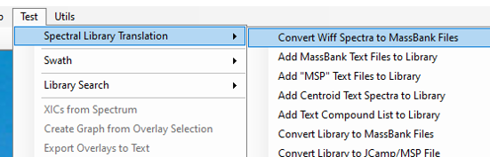

## LC-MS-WIFF-File-Preparation-Tool
A tool to automate input file creation for PeakView's MassBank spectral export from SCIEX WIFF/WIFF2 data.

This repository contains a C++ program designed to streamline the conversion of proprietary **SCIEX WIFF/WIFF2** files into MassBank-compatible text files. The tool is particularly useful for LC-MS workflows where conversion tools like ProteoWizard struggle to produce reliable centroided spectra.

## Features
- Automates the creation of input files required for PeakView's *Spectral Library Translation* extension.
- Accepts simple input dictionaries with **compound names**, **formulas**, and **sample information**.
- Handles hundreds of samples efficiently, reducing manual effort.

## Requirements
- **PeakView** with the *MassBank Files* extension.
- Input files:
  - `compound_info.txt`: List of compounds with their names and formulas.
  - `sample_info.txt`: Text containing pasted sample information (obtained via *Show -> Sample Information* in SciexOS).
  Example of both files are provided in folder `example_files`.
    


## Usage
1. Place your `compound_info.txt` and `sample_info.txt` in the working directory.
2. Run the program to generate the required experiment list input file.



4. Use the output file in PeakView to convert WIFF/WIFF2 spectra to MassBank files.

## Installation
Clone the repository:
```bash
git clone https://github.com/yourusername/LCMS-WIFF-Converter.git
```

Compile the program:
```bash
g++ -o lcms_converter main.cpp
```
Alternatively, use the pre-compiled binary for convenience.

Files Included
`main.cpp`: Source code for the program.
Pre-compiled binary : Ready-to-run executable.
Contributing
Feel free to submit issues or pull requests to improve functionality or documentation.
